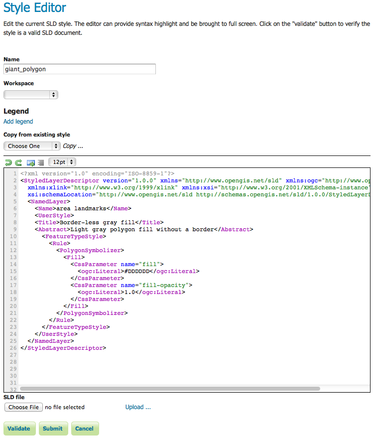

.. _webadmin_styles:

Styles
======

Styles are used to control the appearance of geospatial data. Styles for GeoServer are written in Styled Layer Descriptor (SLD), a subset of XML. Please see the section on :ref:`styling` for more information on working with styles. 

On the Styles page, you can register or create a new style, edit an existing style, or delete remove a style.

.. figure:: ../images/data_style.png
   :align: center
   
   *Styles page*

Edit Styles
-----------

The :guilabel:`Style Editor` page presents options for configuring a style's name and code. SLD names are specified at the top in the name field. Typing or pasting of SLD code can be done in an embedded  edit area.

   
   *Rich text editor*
   
The rich editor is designed for line numbering, and real-time syntax highlighting. You can also reformat your XML document. 

.. list-table::
   :widths: 25 75 

   * - **Button**
     - **Description**

   * - .. image:: ../images/data_style_editor1.png
     - undo
   * - .. image:: ../images/data_style_editor2.png
     - redo  
   * - .. image:: ../images/data_style_editor3.png
     - goto line
   * - .. image:: ../images/data_style_editor4.png
     - go to line     
   * - .. image:: ../images/data_style_editor5.png
     - font size

To confirm that the SLD code is fully compliant with the SLD schema, click the :guilabel:`Validate` button. A message box will confirm whether the style contains validation errors.

.. note:: GeoServer will sometimes render styles that fail validation, but this is not recommended. 

.. figure:: ../images/data_style_editor_noerrors.png
   :align: center
   
   *No validation errors* 
   
.. figure:: ../images/data_style_editor_error.png
   :align: center
   
   *Validation error message* 

Add a Style
-----------

The buttons for adding and removing a style can be found at the top of the :guilabel:`Styles` page. 

.. figure:: ../images/data_style_add_delete.png
   :align: center

   *Adding or removing a style*
   
To add a new layer group, select the :guilabel:`Add a new style` button. You will be redirected to an editor page. Enter a name for the style. The editor page provides two options for submitting an SLD. You can paste the SLD directly into the editor, or you can select and upload a local file that contains the SLD.

.. figure:: ../images/data_style_upload.png
   :align: center

   *Uploading an SLD file from your local computer*
   
Once a style is successfully submitted, you will be redirected to the main :guilabel:`Styles` page where the new style will be listed.

Remove a Style
--------------

To remove a style, select the check box next to the style. Multiple layer groups can be selected for batch removal. Click the :guilabel:`Remove selected style(s)` link at the top of the page. You will be asked to confirm or cancel the deletion. Clicking :guilabel:`OK` removes the layer group. 
 
.. figure:: ../images/data_style_delete.png
   :align: center
   
   *Confirmation prompt for removing styles*

Add a Legend
------------

By default GeoServer will generate a legend based on your SLD file. You can use the :guilabel:`Add legend` link to provide a custom legend.

.. figure:: ../images/data_style_add_legend.png
   
   *Legend*

Use :guilabel:`Online Resource` to reference one of the images in your styles folder. See  :ref:`data_dir_structure` for a description of the styles folder. 
     
Use :guilabel:`Width`, :guilabel:`Height` and :guilabel:`Format` to describe your image or click :guilabel:`Auto-detect image size and type` to fill in these fields.

Use :guilabel:`Discard legend` to remove your custom legend and revert to legend generation based on your SLD file.

